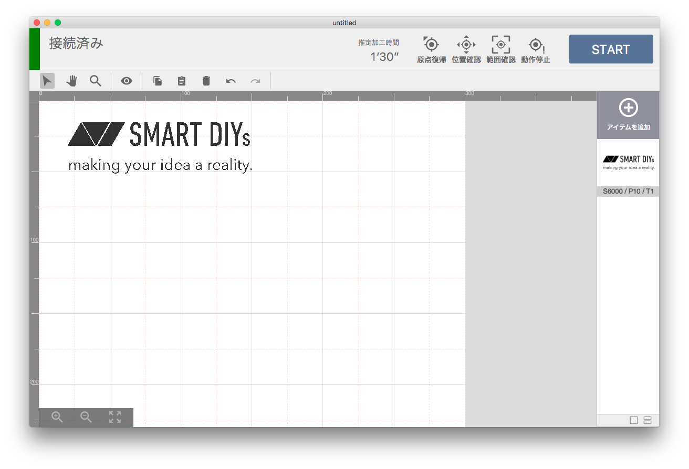

SmartDIYs Creator は FABOOL Laserシリーズ、EtcherLaserシリーズ、及びLC/HLシリーズ対応の加工用ソフトウェアです。
画像データを取り込んでレイアウトを編集し、レーザパラメータを設定して加工を行うソフトウェアです。

---

## 製品仕様
### 対応製品
FABOOL Laser Mini / FABOOL Laser CO2 / FABOOL Laser DS / 
Etcher Laser / Etcher Laser Pro / SC300 / LC950 / HL650 / HL650R

### 対応ファイル
png / jpg / bmp / gif / tif / svg / dxf (R12形式推奨)

### ソフトウェアの動作要件
#### Windows
- OS: Windows 10 以降 (64bit)
- CPU: Core i3 2.4Ghz以上 (ARMアーキテクチャには対応しておりません)
- RAM：4GB以上
- HDD：1GB以上の空き容量

#### macOS
- OS: macOS 12.7 以降 
- CPU：Core M 1.1Ghz以上
- RAM：4GB以上
- HDD：1GB以上の空き容量

## ご注意
- 本マニュアルのスクリーンショット等は実際のソフトウェアの表示と異なる場合がございます。
- 内容に関しては予告無しに更新されることがあります。
- 本製品の運用を理由とする損失、逸失利益などの請求につきましては、いかなる責任も負いかねますのであらかじめご了承ください。
- Microsoft Windowsは、米国 Microsoft Corporation の米国およびその他の国における登録商標または商標です。
- Apple、App Store、Apple ロゴ、Mac、Mac OS、OS X、macOS、iPad、iPhoto、iPod touch、および iTunes は、Apple Inc. の商標です。
- Adobe、Adobe Illustrator および Photoshop は、 Adobe Systems Incorporatedの米国およびその他の国における登録商標または商標です。
