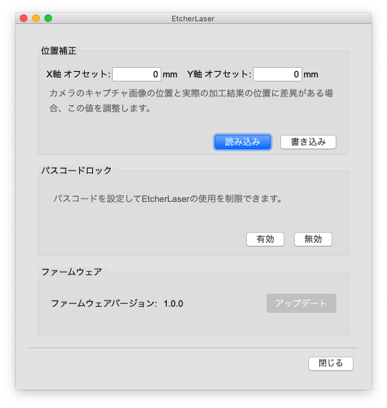
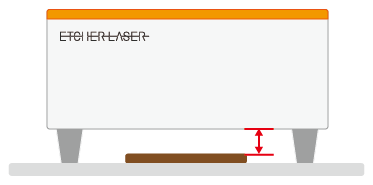

ここでは、EtcherLaser用の機能について説明します。

```
EthcerLaserをお使いの方は、ユーザ設定の「モデル名」を"EtcherLaser"に設定していることを確認して下さい。<br>
また、ソフトウェアとEtcherLaserが接続されていない場合は一部機能が無効になります。
```

## EtcherLaserダイアログ

`メニューバー` > `設定` > `EtcherLaser` をクリックするとEtcherLaserダイアログが表示されます。


<p align="center">

</p>


### 位置補正
カメラのキャプチャ画像の位置と実際の加工結果の位置に差異がある場合、この値を調整します。<br>

### パスコードロック
EtcherLaserに4桁のパスコードを設定して使用を制限することできます。<br>
パスコードが設定されているEtcherLaserは、接続時にパスコード認証を行わないと動作させることができません。<br>
この機能は有効・無効の設定も可能です。

### ファームウェア
EtcherLaserのファームウェアの更新を行うことができます。
アップデート可能な場合は、ボタンが有効になります。


## スキャン

<p align="center">

</p>

加工機のカメラでスキャンした画像からデータを作成することができます。<br>
オリジナル画像（ラスタ加工）・塗りつぶし（ベクタ塗り加工）・輪郭線（ベクタ線加工）を選択できます。<br>
カメラマーカが障害物で隠れないように注意してください。<br>
※上蓋が閉まっている場合はボタンが無効になります。


## キャプチャ

<p align="center">

</p>

ツールバーにあるキャプチャアイコンをクリックすると、加工機のカメラで撮影した加工エリアの範囲をキャンバス上に表示することができます。<br>
カメラマーカが障害物で隠れないように注意してください。<br>
※レンズの歪み等で表示位置に多少の誤差が生じることがございます。<br>
※上蓋が閉まっている場合はボタンが無効になります。<br>
※底蓋を外してスキャンする場合、加工ベッドを基準として加工面の高さをマイナスの数値で入力します。<br>

<p align="center">

</p>

### キャプチャ時のトラブルシューティング

#### 位置が異なる場合
位置補正値の値を設定頂くことで軽減することが可能です。

1. EtcherLaser ダイアログを開きます。
2. 「位置補正」の項目から各軸の補正値を入力します。<br>
 例）実際の加工位置を右に1mm、上に0.5mm移動したい場合 => X: 1mm / Y: -0.5mm
3. 「書き込み」ボタンを押下して、ウインドウを閉じます。

#### スケールが異なる場合
プレビュー画像と刻印結果のスケールが異なる場合は、キャプチャ時の高さ入力が適切でない可能性がございます。<br>
※キャプチャ対象面の高さに応じてキャプチャ画像をスケーリングしております。<br>
ワークエリアからキャプチャ表面（加工面）までの高さを入力してください。

#### 直線が歪んでキャプチャされる場合
カメラレンズの歪みによって引き起こされている可能性がございます。<br>
レンズの製造を行う上で完全な球面を作ることが困難であり、微妙な凹凸がキャプチャ結果に影響を及ぼすことで最大で2〜3mmのズレが発生する可能性がございます。<br>
これは製造上避けることができない問題であるため、何卒ご了承頂ければ幸いです。
