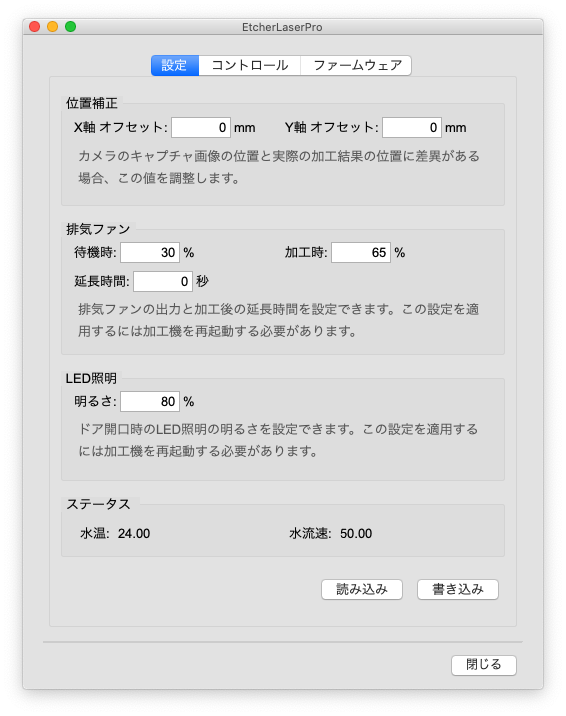

ここでは、EtcherLaserPro用の機能について説明します。

```
EthcerLaserProをお使いの方は、ユーザ設定の「モデル名」を"EtcherLaserPro"に設定していることを確認して下さい。  
また、ソフトウェアとEtcherLaserProが接続されていない場合は一部機能が無効になります。
```

## EtcherLaserProダイアログ

`メニューバー` > `設定` > `EtcherLaser` をクリックするとEtcherLaserProダイアログが表示されます。


<p align="center">

</p>


### 位置補正
カメラのキャプチャ画像の位置と実際の加工結果の位置に差異がある場合、この値を調整します。  

### 排気ファン
排気ファンの出力を設定できます。この設定を適用するには加工機を再起動する必要があります。  
```
待機時: [0 - 50] / 加工時: [30 - 100] の範囲で設定することができます。
```

### ステータス
水温と水流速の値を表示しています。「水温警告」の表示があった場合にご確認ください。

### コントロール
エアーコンプレッサーを動作させることが可能です。レーザー菅の水抜きが必要な際にご利用頂けます。

### パスコードロック
EtcherLaserProに4桁のパスコードを設定して使用を制限することできます。   
パスコードが設定されているEtcherLaserProは、接続時にパスコード認証を行わないと動作させることができません。  
この機能は有効・無効の設定も可能です。

### ファームウェア
EtcherLaserProのファームウェアの更新を行うことができます。
アップデート可能な場合は、ボタンが有効になります。


## スキャン

<p align="center">

</p>

加工機のカメラでスキャンした画像からデータを作成することができます。  
オリジナル画像（ラスタ加工）・塗りつぶし（ベクタ塗り加工）・輪郭線（ベクタ線加工）を選択できます。  
カメラマーカが障害物で隠れないように注意してください。  
※上蓋が閉まっている場合はボタンが無効になります。


## キャプチャ

<p align="center">

</p>

ツールバーにあるキャプチャアイコンをクリックすると、加工機のカメラで撮影した加工エリアの範囲をキャンバス上に表示することができます。  
カメラマーカが障害物で隠れないように注意してください。  
※レンズの歪み等で表示位置に多少の誤差が生じることがございます。  
※上蓋が閉まっている場合はボタンが無効になります。

### キャプチャ時のトラブルシューティング

#### 位置が異なる場合
位置補正値の値を設定頂くことで軽減することが可能です。

1. EtcherLaserPro ダイアログを開きます。
2. 「位置補正」の項目から各軸の補正値を入力します。  
 例）実際の加工位置を右に1mm、上に0.5mm移動したい場合 => X: 1mm / Y: -0.5mm
3. 「書き込み」ボタンを押下して、ウインドウを閉じます。

#### スケールが異なる場合
プレビュー画像と刻印結果のスケールが異なる場合は、キャプチャ時の高さ入力が適切でない可能性がございます。  
※キャプチャ対象面の高さに応じてキャプチャ画像をスケーリングしております。  
ワークエリアからキャプチャ表面（加工面）までの高さを入力してください。

#### 直線が歪んでキャプチャされる場合
カメラレンズの歪みによって引き起こされている可能性がございます。  
レンズの製造を行う上で完全な球面を作ることが困難であり、微妙な凹凸がキャプチャ結果に影響を及ぼすことで最大で2〜3mmのズレが発生する可能性がございます。  
これは製造上避けることができない問題であるため、何卒ご了承頂ければ幸いです。
