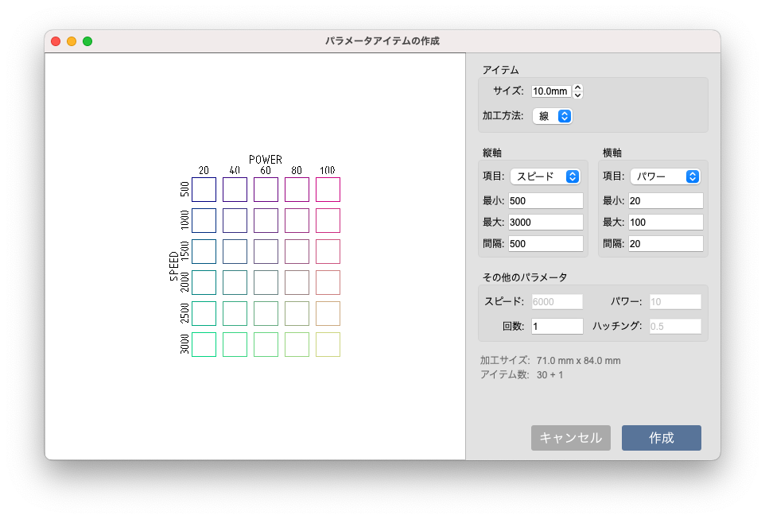

メニューバーにある「パラメータ > パラメータアイテムの作成」をクリックすると、さまざまなパラメータを一括で作成することができます。この機能を活用することで、加工パラメータの決定をサポートします。

<p align="center">

</p>


```
※ 加工パラメータによっては炎が上がる場合がございます。素材に強いエネルギーを与える場合は十分注意してください。
```

## 設定項目

### アイテム
- サイズ: アイテムのサイズを設定します。<br/>
- 加工方法: 線または塗り加工を選択できます。<br/>

### 縦軸・横軸
- 項目: 試行するパラメータ項目を選択します。
- 最小: パラメータの最小値を設定します。
- 最大: パラメータの最大値を設定します。
- 間隔: 最小値から最大値まで、ここで設定した間隔でパラメータが作成されます。

### その他のパラメータ
変化しないパラメータの規定値を設定します。


## データの作成
「加工サイズ」を確認し、素材のサイズに収まるかどうかを確認します。<br>
「アイテム数」は作成する加工アイテムの総数を示しています。<br/>
※LC950の場合、一度に加工できるアイテム数に上限(50個まで)がありますのでご注意ください。

「作成」ボタンを押すと現在のプロジェクトファイルにインポートされます。
