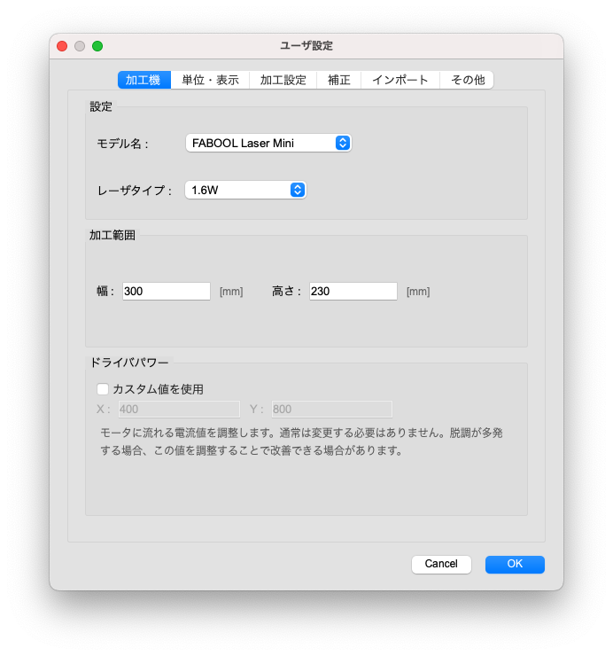

ここでは、ユーザ設定ダイアログの設定項目について説明します。

<p align="center">

</p>

## 加工機

<!-- <p align="center">

</p> -->

### 設定
お使いの加工機のモデル名とレーザタイプを設定します。この設定は、加工範囲やドライバパワー、プリセットパラメータに影響します。

### 加工範囲
お使いの加工機の加工範囲を設定します。上記のモデル名を選択すると自動的に設定されるため、通常は設定を変える必要はございません。拡張フレーム等を利用する場合に設定します。

### ドライバパワー
モータに流れる電流値を調整します。上記のモデル名を選択すると自動的に設定されるため、通常は変更する必要はありません。脱調が多発する場合、この値を調整することで改善できる場合があります。

---------------
## 単位・表示

<!-- <p align="center">

</p> -->

### 単位
グリッドの間隔やオブジェクトの矩形表示単位などを mm または inch に設定できます。

### 表示
グリッドの表示・非表示の切り替えができます。<br/>
また、グリッド間隔と分割数を設定することができます。基本グリッドはキャンパス上に灰色で表示され、分割グリッドは赤色の点線で表示されます。分割数を1にすると、基本グリッドのみ表示されます。

### プレビュー
プレビュー時の線幅を指定します。実際のレーザ幅に設定することで仕上がりの印象に近づきます。

---------------
## 加工設定

<!-- <p align="center">

</p> -->

シーク速度：レーザヘッドがレーザを出力していない時の移動速度です。基本的にレーザ出力が終了した地点から、次のレーザ出力開始点までの移動速度になります。

### シーク速度
- Defaultモード: シーク速度を指定した値に設定します。
- Qualityモード: シーク速度を加工速度に合わせます。

※ラスタ加工中やハッチング加工中（ベクタ塗り加工中）は、常にQualityモードに準ずる動作で行われます。

### シーク速度（メンテナンス時）
位置確認や範囲確認を行う際のレーザヘッドの移動速度を設定できます。

### 繰り返し加工（ベクタ線）
この設定を有効にした場合、切断加工の際の加工順序に影響があります。<br/>
「同一アイテム」内に複数の図形（◯ △などのパーツ）があり、回数パラメータが2以上に設定されている場合は下記の順序になります。<br/>
[有効]: ◯ > ◯ > △ > △   [無効]: ◯ > △ > ◯ > △

### 刻印方向
ラスタ加工やベクタ塗り加工を行う際の刻印方向を設定できます。

---------------
## 補正

<!-- <p align="center">

</p> -->

```
※これらの機能は補助的なものです。
ハードウェアの調整を十分に行なった上でご利用ください。
```

### 大きさ補正
図形を各方向へ指定された割合だけ拡大・縮小します。オブジェクトが加工範囲の境界近くにある場合、加工中にリミットスイッチに接触してしまう恐れがあります。

### X軸傾き補正
加工機のX軸の傾きを補正するため図形にシアーを適用します。右上がりを補正する時は、マイナスの値を入力してください。オブジェクトが加工範囲の境界近くにある場合、加工中にリミットスイッチに接触してしまう恐れがあります。

### スキャン補正
ベクタ塗り加工やラスタ加工時の左右の輪郭のブレを軽減します。オブジェクトが加工範囲の境界近くにある場合、加工中にリミットスイッチに接触してしまう恐れがあります。


<!-- ---------------
## パラメータ

<p align="center">

</p>

### パラメータ初期値
新しいアイテムをインポートする際に設定されるレーザパラメータのデフォルト値を設定します。すでに生成されているパラメータには影響しません。 -->

---------------
## その他

<!-- <p align="center">

</p> -->

### インターバル
自動インターバルを設定することができます。連続加工時間を超過した場合、指定時間だけ加工を一時停止します。<br/>
※この時間は推定加工時間や推定残り時間には加算されません。

```
加工時間: [10 - 60]分 / 休止時間: [3 - 10]分 の範囲で設定することができます。
```


### 通知
ソフトウェアアップデートの自動通知の有効・無効を設定します。新しいバージョンがある場合、ソフトウェア起動時にダイアログが表示されます。
